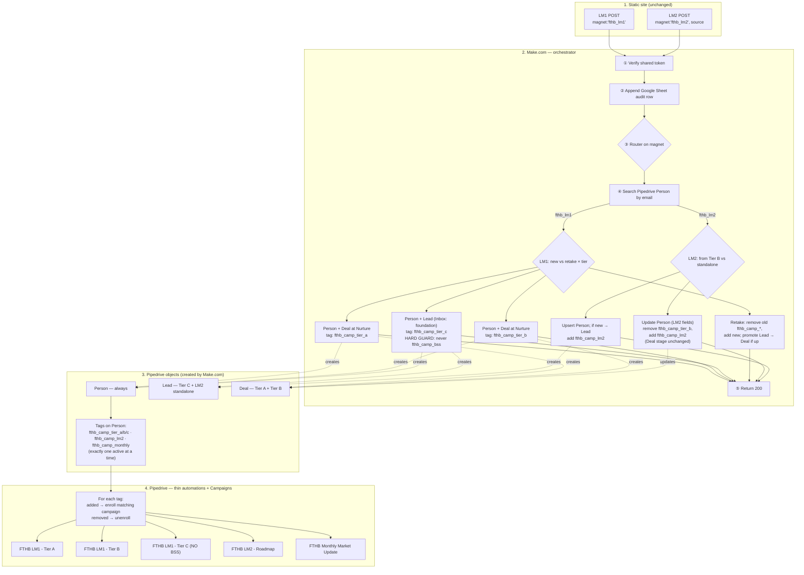

# FTHB Funnel — Alternative: Make.com-driven Automation Flow

Alternative to `automation-flow.md`. Same site, same Pipedrive Campaigns, same email copy. The difference is where the routing logic lives: **Make.com is now the orchestrator**. It creates Pipedrive People, Leads, and Deals directly, manages a single tag namespace on the Person, and Pipedrive runs only thin one-line automations of the form "tag added → enroll campaign, tag removed → unenroll campaign."

This is the right choice if you (a) want to debug routing logic visually in Make.com, (b) want Pipedrive's pipeline and Leads Inbox views to mirror real funnel state out of the box, and (c) are comfortable trading more Make.com ops per submission for less Pipedrive automation surface.

## The architecture in one sentence

The static site POSTs to one Make.com webhook; Make.com **decides everything** — which Pipedrive object to create (Person + Deal for warm tiers, Person + Lead for cold ones), which fields to set, and which single `fthb_camp_*` tag to apply or swap; Pipedrive's only job is to send email when a tag appears and stop when it disappears.

## Flow diagram (Mermaid)

The same diagram is rendered visually in the conversation that produced this file.

---

## What changes from the original split

The static site is unchanged. The Pipedrive Campaigns themselves are unchanged — same five campaigns, same email copy from `docs/04` and `docs/07`. Everything else moves.

The fields stay; the orchestration moves. Make.com still writes `fthb_lm1_tier`, `fthb_lm1_display_score`, `fthb_received_lm1`, `fthb_received_lm2`, etc. — those are useful in Pipedrive segments, reports, and the agent's own filtering. But these fields are no longer the **trigger** for routing. The trigger is now the `fthb_camp_*` tag, which Make.com manipulates explicitly.

Five Pipedrive Workflow Automations collapse to one pattern repeated five times. The original design has WA1–WA5 each doing real conditional logic (branching on tier, watching for cross-field combinations, comparing old vs new tier on retake). In this design, every Pipedrive automation is the same trivial shape: "Person tagged with `fthb_camp_X` → enroll in campaign `FTHB LM1 - X`" and "untagged → unenroll." No branching, no compound conditions, no field comparisons. Five instances, one pattern. That's what "basic" means here.

Pipedrive becomes a viewing surface, not a logic surface. Tier A and Tier B contacts show up as Deals in a "Buyer Pipeline" whose five stages (`Nurture`, `BSS Booked`, `Pre-Approved & Searching`, `Under Contract`, `Closing`; see "Buyer Pipeline stages" below) reflect real buyer activity, so the agent sees real funnel state at a glance. Tier C and LM2-standalone contacts show up as Leads in the Leads Inbox, which is exactly what Pipedrive's Leads view is designed for: things that aren't pipeline-active yet but should be revisited.

---

## What lives where in this design

### Static Astro site (unchanged)

The site still computes the score client-side, posts to one Make.com webhook with `magnet: fthb_lm1` or `fthb_lm2`, redirects to the result page from query params, and fires analytics from the browser. No change. The whole point of this alternative is that the contract on the wire is identical — only Make.com's internals change.

### Make.com — the new heavy lifter

One scenario, still triggered by the single webhook, but now considerably thicker. Steps in order:

1. **Verify the baked shared token.** Drop the request on mismatch, log the drop. Same as before.
2. **Append the audit row to Google Sheets.** Still first, still the failure-recovery surface.
3. **Router on `magnet`.** Splits into the LM1 and LM2 sub-flows below.
4. **Search Pipedrive Person by email.** Always. Both sub-flows need to know if this contact already exists before deciding whether to create a Lead, create a Deal, or update an existing Deal.

For **LM1**, branch on `(existing? × tier)`:

- **New + Tier A (READY_NOW):** Create the Person with all answer fields, tier fields, `fthb_received_lm1 = true`. Create a Deal in the "Buyer Pipeline" at stage `Nurture`. Add tag `fthb_camp_tier_a`. The Deal advances to `BSS Booked` when the calendar tool fires its own webhook to Make.com — not at Person creation.
- **New + Tier B (NINETY_DAY):** Create the Person with the same fields. Create a Deal in the "Buyer Pipeline" at stage `Nurture`. Add tag `fthb_camp_tier_b`.
- **New + Tier C (FOUNDATION):** Create the Person with the same fields. Create a **Lead** (not a Deal) in the Leads Inbox with label `foundation`. Add tag `fthb_camp_tier_c`. **Never** add `fthb_camp_bss`, ever — this is the BSS hard guard, now a single line in the Make.com module configuration. If a future flow needs to pitch BSS to Foundation, the answer is a tier change (via retake), not a tag flip.
- **Retake (Person exists):** Update the Person fields, set `fthb_lm1_retaken_at = now`. Compare old tier to new tier. If the tier changed, remove the old `fthb_camp_*` tag and add the new one in the same scenario run (so Pipedrive sees the swap atomically). If the new tier is A or B and the contact was previously a Lead, promote the Lead to a Deal (Pipedrive API supports `/leads/{id}/conversion`) or create a fresh Deal and archive the Lead. If the new tier is C and the contact had a Deal, move that Deal to a "Lost — re-nurture" stage rather than deleting it.

For **LM2**, branch on `source`:

- **`source = fthb_lm1_tier_b` (the common path):** Update the existing Person — set `fthb_received_lm2 = true`, `fthb_lm2_received_at = now`, `fthb_lm2_source = fthb_lm1_tier_b`. Tag operation: remove `fthb_camp_tier_b`, add `fthb_camp_lm2`. This is the pause-and-swap rule from `docs/07`, now expressed as one Make.com action rather than a Pipedrive automation watching for `fthb_received_lm2` to flip. The Deal stage does **not** advance — LM2 consumption is a campaign event, not a buyer-activity event. The Deal stays at `Nurture` until a calendar booking arrives (advances to `BSS Booked`) or a pre-approval letter is recorded (advances to `Pre-Approved & Searching`). Optionally, drop a note on the Deal: "Received LM2 on {date}" for the agent's audit trail.
- **`source = fthb_lm2_standalone`:** Search by email. If found (rare — usually means a prior LM1 contact who never hit Tier B), update with the LM2 fields and add `fthb_camp_lm2`. If not found, create the Person + a Lead with label `lm2_standalone`, set the LM2 fields, and add `fthb_camp_lm2`.

Then `⑤ Return 200`.

The whole Make.com scenario is one routable graph. The seven leaf-node modules (3 LM1 tiers + 1 retake + 2 LM2 source paths + a fall-through error path) each do the same shape of work: write fields on the Person, create or update the Lead/Deal, and stamp exactly one `fthb_camp_*` tag. Adding a new tier later (e.g., a `FTHB LM1 - Tier B-plus` for an intermediate segment) is one new leaf node and one new Pipedrive automation, not an architectural change.

**One scheduled secondary scenario, optional but useful:** a daily Make.com job that scans Pipedrive for Persons whose last campaign completed > N days ago and promotes them to `fthb_camp_monthly` (replacing whichever tier tag they have). This replaces "WA5 graduate to monthly" from the original. Cleaner than trying to listen for a campaign-completion event in Pipedrive, which is awkward to model.

### Pipedrive — thin and viewable

Three things only:

1. **Custom fields on Person.** Same list as the original — `fthb_lm1_tier`, `fthb_lm1_display_score`, `fthb_received_lm1`, `fthb_received_lm2`, `fthb_lm2_source`, `fthb_lm1_retaken_at`, `fthb_q1_credit_range … fthb_q10_lender`. Make.com still writes them; the agent uses them for filters and segments.
2. **Tags on Person.** The new control surface: `fthb_camp_tier_a`, `fthb_camp_tier_b`, `fthb_camp_tier_c`, `fthb_camp_lm2`, `fthb_camp_monthly`. **Invariant: exactly one active at a time.** Make.com is responsible for that invariant; Pipedrive doesn't police it.
3. **One basic automation per tag** (so five total). Each one is a one-trigger / one-action rule of the shape: *Trigger: Person tag added = X → Action: enroll in campaign Y at email 1.* Pair each with a matching *Trigger: tag removed → Action: unenroll.* That's it. No branching, no compound conditions, no field comparisons.

### Buyer Pipeline stages

The Buyer Pipeline has **five** stages, in order. Each stage maps to a distinct change in agent activity (not external activity), so probability bands and rotting times are meaningful. Won/Lost are Pipedrive's terminal Deal statuses, not stages.

| # | Stage | Entry criteria | Agent activity in this stage | Probability | Rotting time |
|---|---|---|---|---|---|
| 1 | `Nurture` | Deal created from LM1 (Tier A or Tier B). | Monitor for replies. Pipedrive Campaigns is doing the talking. | 10–15% | 90 days |
| 2 | `BSS Booked` | Calendar tool fires its webhook with a confirmed event for this contact's email. | Prep for the call: review scorecard answers, target areas, snapshot data. | 30–40% | 14 days |
| 3 | `Pre-Approved & Searching` | Agent records a real pre-approval letter (not pre-qualification — see Email A3) against the Deal. | Send listings, schedule showings, vet neighborhoods. | 50–65% | 60 days |
| 4 | `Under Contract` | Offer accepted; contract signed. | Coordinate inspection, appraisal, underwriting. | ~90% | 60 days |
| 5 | `Closing` | Clear to close issued. | Final walk-through, signing day logistics. | ~98% | 14 days |

**Stage advancement is event-driven.** `Nurture → BSS Booked` is the calendar webhook (Cal.com or Calendly → Make.com → Pipedrive Deal stage update). `BSS Booked → Pre-Approved & Searching` is the agent recording a pre-approval letter on the Deal — there is no automated way to detect this, so it's a manual stage move. The remaining advances are the agent's job during the actual transaction.

**What does *not* advance the stage:** consuming LM2, opening an email, getting a new tier on retake. Tag swaps and campaign membership are orthogonal to pipeline stage — that's the whole point of having them be different surfaces.

**What doesn't have its own stage and why:**

- *BSS Completed.* Splitting "Booked" from "Completed" doesn't change agent activity — the next blocker after the call is the pre-approval letter, and stage 3 is exactly that gate.
- *Inspection / Appraisal / Underwriting.* These run in parallel inside Under Contract; the agent's job during all three is the same (coordinate, chase, communicate). Three sub-stages would create columns the agent has to manually keep in sync without surfacing new decisions.
- *Lost — re-nurture.* This is Pipedrive's `Lost` deal status with a reason field, not its own pipeline column. A demoted-from-A-to-C retake marks the Deal as Lost with reason "Retake demoted to Foundation" and the contact stays in the Leads Inbox via the tag swap.

### Pipedrive Pipelines and Leads Inbox — at-a-glance state

| Object | Where it lives | Why |
|---|---|---|
| Tier A Person | Person record + Deal in Buyer Pipeline at `Nurture` (advances to `BSS Booked` on calendar webhook) | Active opportunity. Agent should see them in the pipeline view. |
| Tier B Person | Person record + Deal in Buyer Pipeline at `Nurture` | Engaged but not closing yet. Pipeline view shows the warm bench. |
| Tier B → LM2 Person | Same Deal, stage unchanged. Tag swap drives the campaign change. | LM2 consumption is a campaign event, not a pipeline event. Stage advances on real activity (calendar booking, pre-approval letter). |
| Tier C Person | Person record + Lead in Leads Inbox (label: foundation) | Not pipeline-active. Doesn't crowd the Deal view. Revisit-able. |
| LM2 standalone Person | Person record + Lead in Leads Inbox (label: lm2_standalone) | Same logic — not yet tier-segmented. |
| Retake C → A/B | Lead converted to Deal at `Nurture`, or Lead archived + new Deal | Graduation surfaces in the pipeline view automatically. |

### Pipedrive Campaigns (unchanged)

Same five campaigns as the original, same emails from `docs/04` and `docs/07`. The difference is in *how* a contact gets enrolled — via a tag-triggered basic automation rather than a field-triggered Workflow Automation that branches on tier. The Email 0 transactional is still the first step of each per-tier campaign so unsubscribes propagate cleanly.

| Campaign | Activated by tag | Deactivated by tag removal |
|---|---|---|
| `FTHB LM1 - Tier A` | `fthb_camp_tier_a` added | `fthb_camp_tier_a` removed |
| `FTHB LM1 - Tier B` | `fthb_camp_tier_b` added | `fthb_camp_tier_b` removed |
| `FTHB LM1 - Tier C` | `fthb_camp_tier_c` added | `fthb_camp_tier_c` removed |
| `FTHB LM2 - Roadmap` | `fthb_camp_lm2` added | `fthb_camp_lm2` removed |
| `FTHB Monthly Market Update` | `fthb_camp_monthly` added | `fthb_camp_monthly` removed |

---

## How the locked rules are enforced in this design

**Tier C never gets the BSS.** Make.com's Tier-C leaf node never writes the `fthb_camp_bss` tag, and there is no Make.com path that produces it for a Person whose current tier is FOUNDATION. The hard guard is a single configuration check in one Make.com module, easier to audit than the original's "WA1 branch + content review of the Tier C campaign."

**LM2 from Tier B unenrolls Tier B.** The `fthb_lm1_tier_b` leaf node does the tag swap atomically in one Make.com run: `remove fthb_camp_tier_b` then `add fthb_camp_lm2`. The corresponding two Pipedrive automations fire — one unenrolls from `FTHB LM1 - Tier B`, the other enrolls in `FTHB LM2 - Roadmap`. The contact is in transit between campaigns for seconds, not minutes.

**Retake transitions don't double-enroll.** The retake leaf node does the same atomic tag swap with the new tier's tag, before returning 200.

**The single-tag invariant.** Every Make.com leaf node sets exactly one `fthb_camp_*` tag and removes any others on the same Person. Build this as a small Make.com sub-scenario or a helper module called from each leaf, so the invariant is one line of logic, not five copies of it.

---

## Trade-offs vs. the original

This isn't strictly "better" — it trades one set of properties for another.

**You gain:**

- **One place to debug routing.** When a contact ends up in the wrong campaign, you open the Make.com scenario log and see exactly which branch ran, what fields were written, and which tags were set. In the original, you'd have to inspect both Make.com's call to Pipedrive and Pipedrive's automation history.
- **Pipedrive UI mirrors funnel state.** Buyer Pipeline shows Tier A and B. Leads Inbox shows Tier C and standalone. The agent gets that for free without building filtered views.
- **Adding a new branch is one place.** Want a "Tier B-plus" between B and A? One new Make.com leaf, one new tag, one new basic automation. The original would need a new WA, new field logic, and possibly a new campaign trigger.
- **Tag-based automation is portable.** If Pipedrive Campaigns ever gets swapped for another sender, the contract is "tag added/removed → enroll/unenroll" which most senders speak.

**You give up:**

- **More Make.com ops per submission.** Estimate ~8–12 ops per LM1 submit (verify, audit, search Person, create/update Person, create/update Deal or Lead, set fields, add tag, remove old tag, return) vs. ~4–5 in the original. At Hobby plan volumes (1k ops/month) you'd still be fine through Phase 1; budget for Pro ($9–10/month) earlier.
- **Make.com is now load-bearing for state, not just data.** If Make.com is down, you stop accepting new leads — same as the original — but you also lose the ability to swap a tier on retake, which would otherwise be a Pipedrive-internal event. Mitigation: the Google Sheet audit row is still there; you can replay manually.
- **Pipedrive's view becomes "view-only" from a logic perspective.** If you set a tag manually in Pipedrive to test something, no Make.com state updates — the field/tag invariant has to be maintained by Make.com, which means manual Pipedrive edits during normal operation are a smell.
- **Pipedrive API surface used is wider.** You're now calling Persons, Leads, Deals, and Tags. More to learn, more places for the integration to break, more Make.com modules to keep current. The original used essentially just Persons.

**The original wins when:** you want Make.com to be a thin webhook receiver and Pipedrive to own as much of the funnel as possible (e.g., if you're considering moving off Make.com someday, or if Make.com pricing is a constraint).

**This alternative wins when:** you want all the orchestration in one place, and you want Pipedrive's pipeline UI to do real work for you.

---

## What this document is not

This is not a re-derivation of the email copy, the scoring math, the tier thresholds, the funnel rationale, or anything in `docs/`. Those specs are authoritative; this file describes a different way to wire them together. If you adopt this design, `docs/02-readiness-filter-spec.md` and `docs/05-process-map-spec.md` still describe *what* the funnel does — just substitute "Make.com manages tags; Pipedrive enrolls on tag changes" wherever they describe Workflow Automations.

Both `automation-flow.md` and this file exist as alternatives. Pick one before Phase 0 wiring; don't try to run both halfway.
