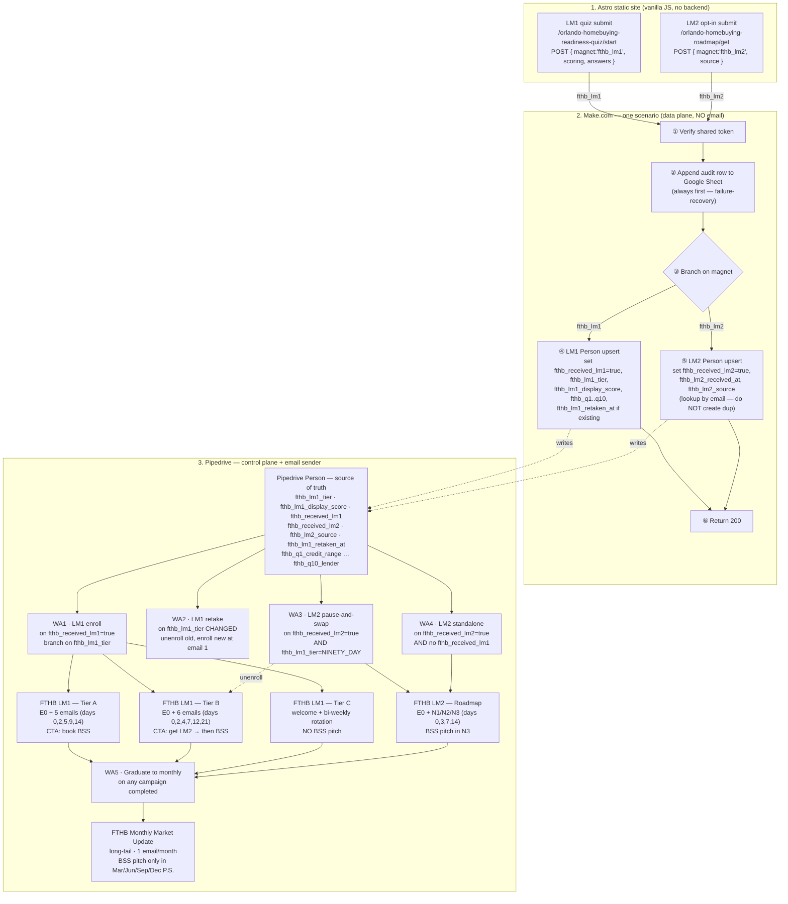

# FTHB Funnel — Automation Flow & Logic Split

Companion to `docs/02-readiness-filter-spec.md`, `docs/05-process-map-spec.md`, `docs/04-readiness-filter-emails.md`, `docs/07-process-map-emails.md`, and `docs/08-implementation-roadmap.md`. This file does not introduce new behavior — it consolidates the automation surface so a single page answers "what fires where, on what, in what order."

## The architecture in one sentence

The static Astro site computes the result and POSTs to **one Make.com webhook**; Make.com is a thin **data plane** that audits to Sheets and writes prefixed custom fields on a Pipedrive Person; **Pipedrive Workflow Automations** are the **control plane** that translate field changes into Pipedrive Campaign enrollments, and **Pipedrive Campaigns** is the only thing that sends email.

## Flow diagram (Mermaid)

The same diagram is also rendered visually in the conversation that produced this file.

---

## Where each piece of logic lives, and why

The boundary between Make.com and Pipedrive is the single most load-bearing design choice in the funnel. Keep it strict — every time someone is tempted to "just send the email from Make.com" or "just compute the tier in a Pipedrive automation," the funnel loses a property it needs.

### What lives on the static Astro site (browser, vanilla JS)

The site is the *only* thing that knows the visitor's answers in real time. Putting more here than necessary creates compliance surface and breaks the no-backend invariant; putting less than necessary makes Make.com a scoring engine, which it isn't built to be.

The site owns: rendering all pages; running the scoring engine client-side and computing `scoring.raw_total`, `scoring.display_score`, `scoring.tier`, and `scoring.applied_overrides`; building the result-page URL with plain query params; firing analytics events directly to the analytics provider; and POSTing the form payload to the single Make.com webhook via `fetch`. Network failure on the POST does not block the redirect — the user already earned the result page.

The site does **not** own: anything about email, anything about CRM state, anything that requires the next page load to remember the previous one. There are no cookies, no `LocalStorage`, no `SessionStorage`. The two `magnet` values on the payload (`fthb_lm1`, `fthb_lm2`) are how the rest of the system tells the funnels apart.

### What lives in Make.com

Make.com is the **data plane**. Its job is to receive the webhook, durably record what came in, and translate the JSON payload into the right field writes on the right Pipedrive Person. It does no scoring, no email, no sequence routing, and no tier-based conditional logic beyond branching on the `magnet` discriminator.

One scenario, one webhook, six steps in order:

1. **Verify the baked shared token.** The webhook URL is in the static bundle, so the token gate is the spam line. Mismatch → drop the request, do not write to Sheets, do not call Pipedrive. (See risk row in `docs/08-implementation-roadmap.md`.)
2. **Append a row to the Google Sheet audit log.** Always first. This is the failure-recovery surface — if Pipedrive 5xx's or times out, the row is still there and the contact can be reconciled manually within 24 hours.
3. **Branch on `magnet`.** `fthb_lm1` → step 4. `fthb_lm2` → step 5. Anything else → drop with a log row.
4. **LM1 path — Person upsert by email.** If the Person doesn't exist, create it with the contact fields, all ten `fthb_q1_credit_range … fthb_q10_lender` answer fields, `fthb_lm1_tier`, `fthb_lm1_display_score`, and `fthb_received_lm1 = true`. If it already exists, update those same fields and set `fthb_lm1_retaken_at = now`. The JSON keys under `payload.answers.*` are unprefixed; Make.com maps them to the prefixed Pipedrive field names (`q1_credit_range` → `fthb_q1_credit_range`).
5. **LM2 path — Person upsert by email.** Look up by email first; if found (the common case — they came from a Tier B result), update with `fthb_received_lm2 = true`, `fthb_lm2_received_at = now`, `fthb_lm2_source = "fthb_lm1_tier_b"`. If not found (a rare standalone path with no prior LM1), create the Person with the contact fields, `fthb_received_lm2 = true`, `fthb_lm2_received_at = now`, and `fthb_lm2_source = "fthb_lm2_standalone"`. Do **not** create a duplicate Person under any circumstance.
6. **Return 200.** The browser has already redirected; this is fire-and-forget from the user's perspective.

Make.com explicitly does **not** send email, decide which campaign to enroll in, unenroll anyone, or implement the Tier C BSS guard. Every one of those is a property of CRM state that Pipedrive owns.

### What lives in Pipedrive — Workflow Automations

Pipedrive is the **control plane**. Every routing decision in the funnel is a Workflow Automation that listens for a field change on the Person and acts on it. The list below is exhaustive — if a new behavior would need a sixth automation, that means a new field on the Person and a new automation, not Make.com logic.

**WA1 — LM1 enroll.** Trigger: `fthb_received_lm1` changes to `true`. Action: read `fthb_lm1_tier` and enroll the Person in the matching campaign at email 1 — `READY_NOW` → `FTHB LM1 - Tier A`, `NINETY_DAY` → `FTHB LM1 - Tier B`, `FOUNDATION` → `FTHB LM1 - Tier C`. Email 0 (the transactional result-link) goes out as the first step of each campaign so the entire delivery path stays inside Pipedrive Campaigns.

**WA2 — LM1 retake.** Trigger: `fthb_lm1_tier` changes value AND `fthb_lm1_retaken_at` was just set. Action: unenroll the Person from the campaign matching the previous tier, then enroll in the campaign matching the new tier starting at email 1. This is how a Foundation contact who comes back stronger graduates without getting the old Tier C drip in parallel.

**WA3 — LM2 pause-and-swap (the cross-magnet rule).** Trigger: `fthb_received_lm2` changes to `true` AND `fthb_lm1_tier = NINETY_DAY`. Action: unenroll from `FTHB LM1 - Tier B` (cancels all scheduled future emails for the contact in that campaign), then enroll in `FTHB LM2 - Roadmap` at Email 0. This is the rule that prevents the double email storm; it is the entire reason the LM2 webhook does an upsert, not an insert.

**WA4 — LM2 standalone.** Trigger: `fthb_received_lm2` changes to `true` AND (`fthb_received_lm1` is not set OR `fthb_lm2_source = "fthb_lm2_standalone"`). Action: enroll in `FTHB LM2 - Roadmap` at Email 0. No pause logic — there's no LM1 campaign to unenroll from.

**WA5 — Graduate to monthly.** Trigger: a Person completes the last email of any of the four front-line campaigns (Tier A E5, Tier B E6, Tier C topic 10 cycle boundary, or LM2 N3). Action: enroll in `FTHB Monthly Market Update`. This is the long-tail nurture every contact eventually lands in.

**The Tier C BSS guard** is not a separate automation — it's a property of WA1: when the tier is `FOUNDATION`, the only enrollment WA1 ever makes is into `FTHB LM1 - Tier C`, and the Tier C campaign content itself never contains a BSS CTA. Encoding it once in WA1 (and never authoring a BSS link into the Tier C campaign) is the hard guard the architecture relies on. If a future automation is tempted to add a BSS pitch to Foundation, the answer is a tier change (via retake), not a sequence change.

**The cadence override** ("reply 'monthly' to drop to monthly") is the agent updating a `nurture_cadence` field on the contact by hand; a small automation that watches that field and moves the contact off the bi-weekly Tier C cadence onto `FTHB Monthly Market Update` is the spec-described version of that flow (see `docs/04`). Treat it as a tiny sixth automation if/when needed — it's not load-bearing for launch.

### What lives in Pipedrive — Campaigns

Pipedrive Campaigns is the sender. Build one campaign per row below; each Workflow Automation references the campaign by name. Email copy is locked in `docs/04-readiness-filter-emails.md` and `docs/07-process-map-emails.md` — copy/paste, don't paraphrase.

| Campaign name | Emails | Cadence | Triggered by | CTA pattern |
|---|---|---|---|---|
| `FTHB LM1 - Tier A` | E0 transactional + A1–A5 | days 0, 0(+10m), 2, 5, 9, 14 | WA1 when `fthb_lm1_tier = READY_NOW` | Book BSS |
| `FTHB LM1 - Tier B` | E0 transactional + B1–B6 | days 0, 0(+10m), 2, 4, 7, 12, 21 | WA1 when `fthb_lm1_tier = NINETY_DAY` | Get LM2 → BSS |
| `FTHB LM1 - Tier C` | C0 welcome + C1, C2, … bi-weekly loop | day 0, then every 14 days through topics 1–10, then repeat | WA1 when `fthb_lm1_tier = FOUNDATION` | Education only — never BSS |
| `FTHB LM2 - Roadmap` | E0 transactional + N1, N2, N3 | days 0, 3, 7, 14 | WA3 (Tier B → LM2) or WA4 (standalone) | BSS pitch in N3 only |
| `FTHB Monthly Market Update` | Monthly | 1st of the month, indefinite | WA5 (any campaign completed) | Soft CTA every month; BSS pitch only in Mar/Jun/Sep/Dec P.S. |

The Email 0 transactional is the first step of each per-tier campaign rather than a separate "send template" — that keeps everything Pipedrive Campaigns-native and lets unsubscribes from the per-tier campaign cleanly stop the transactional path too.

---

## Cross-magnet rules — verified against the locked spec

The two rules that are easy to break when editing either spec in isolation:

**Rule 1 — LM2 from Tier B unenrolls Tier B.** This is the entire reason `fthb_received_lm2` exists as a field. Make.com sets it; WA3 reads it; the Tier B campaign quietly stops mid-sequence with no manual intervention. Verify after Phase 2 ship: submit LM1 as Tier B, click into LM2, confirm in Pipedrive that the contact has no remaining scheduled emails in `FTHB LM1 - Tier B`.

**Rule 2 — Tier C is never pitched the BSS, anywhere.** The hard guard is in WA1's branch (Foundation only enrolls in Tier C) plus the Tier C campaign content itself (no BSS link in any of the bi-weekly emails). The only way a Tier C contact ever reaches a BSS pitch is by retaking the scorecard and landing in A or B (WA2 swap), or by graduating into the monthly list and getting the quarterly P.S. (WA5 → CM). Verify by inspecting the Tier C campaign content before launch: zero occurrences of `{{book_bss_link}}`.

---

## Failure modes the architecture survives

The split above is what lets each of these be a non-event rather than an incident:

- **Pipedrive 5xx during a webhook write.** The Google Sheet row in Make.com step 2 is the durable record. Reconcile by hand within 24 hours; nothing is lost.
- **Make.com webhook URL gets scraped and spammed.** The shared token in step 1 drops bad requests before they create Pipedrive cost. Rotate by redeploying the site with a new token and updating Make.com to match.
- **A user reloads the result page or shares a tampered URL.** The result page renders only from query params and has no state-changing side effects (`docs/02` is explicit on this). Pipedrive has the authoritative tier; whatever the URL claims doesn't matter.
- **A user retakes the scorecard.** Make.com upserts (no duplicate Person); `fthb_lm1_retaken_at` updates; WA2 swaps the campaign cleanly. The contact does not get email 1 of two tiers in the same week.
- **A Tier B contact opts into LM2 and into Tier B's email 4 lands on the same day.** WA3 unenrolls them from the Tier B campaign the moment Pipedrive sees `fthb_received_lm2 = true`. Worst case is a few minutes of overlap, which is well within "no double storm."
- **A user replies "monthly" or "stop".** Pipedrive's standard unsubscribe handles "stop" without code; "monthly" is the agent moving them off Tier C cadence into `FTHB Monthly Market Update` by setting one field.

---

## What this document is not

This is not a re-derivation of the email copy, the scoring math, the tier thresholds, or the funnel rationale. Those live in `docs/` and have precedence per `CLAUDE.md`. If anything here conflicts with `docs/02` or `docs/05`, the spec wins and this file should be updated — not the other way around.
